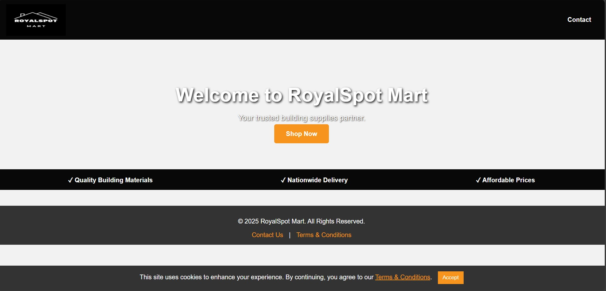

# 🏗️ RoyalSpot Mart - E-commerce System

A professional, full-stack e-commerce platform built for a hardware and building supplies store. This system handles everything from product browsing to database-driven order fulfillment and email notifications.

## 🚀 Key Features
* **Dynamic Product Catalog:** Categorized building supplies (Cement, Bricks, Tools) rendered via JavaScript.
* **Smart Filtering:** Real-time search and category filtering for a seamless user experience.
* **Persistent Shopping Cart:** Uses `localStorage` to keep items in the cart even if the page is refreshed.
* **Secure Checkout:** A dedicated delivery form that validates user input before submission.
* **Backend Integration:** * Saves orders to a **MySQL** database.
    * Sends automated HTML email summaries to the admin using **PHPMailer**.
* **Modern UI:** Fully responsive CSS Grid layout designed for both desktop and mobile.

## 🛠️ Tech Stack
* **Frontend:** HTML5, CSS3 (Modern Grid/Flexbox), JavaScript (ES6)
* **Backend:** PHP 8.x
* **Database:** MySQL
* **Dependencies:** PHPMailer, phpdotenv (via Composer)
* **Environment:** Laragon / Apache

## ⚙️ Installation & Setup
1.  **Clone the project** into your `laragon/www` folder.
2.  **Install Dependencies:** Run `composer install`.
3.  **Database Setup:** Create a database named `royalmart_db` and an `orders` table.
4.  **Configuration:** Create a `.env` file based on the environment variables needed for `config.php`.
5.  **Access:** Open via `http://localhost/RoyalSpot Mart`.

## 📸 Preview

  

---
© 2025 RoyalSpot Mart. Developed by Somila.